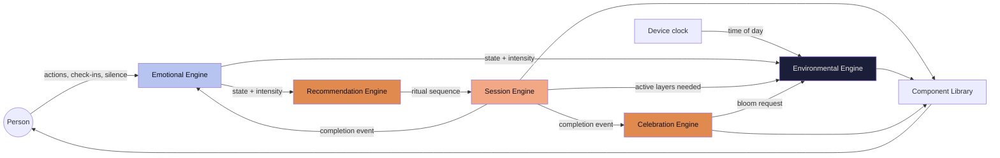
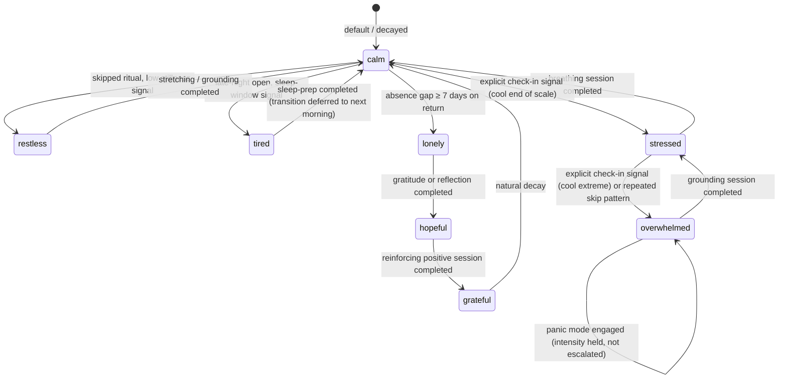
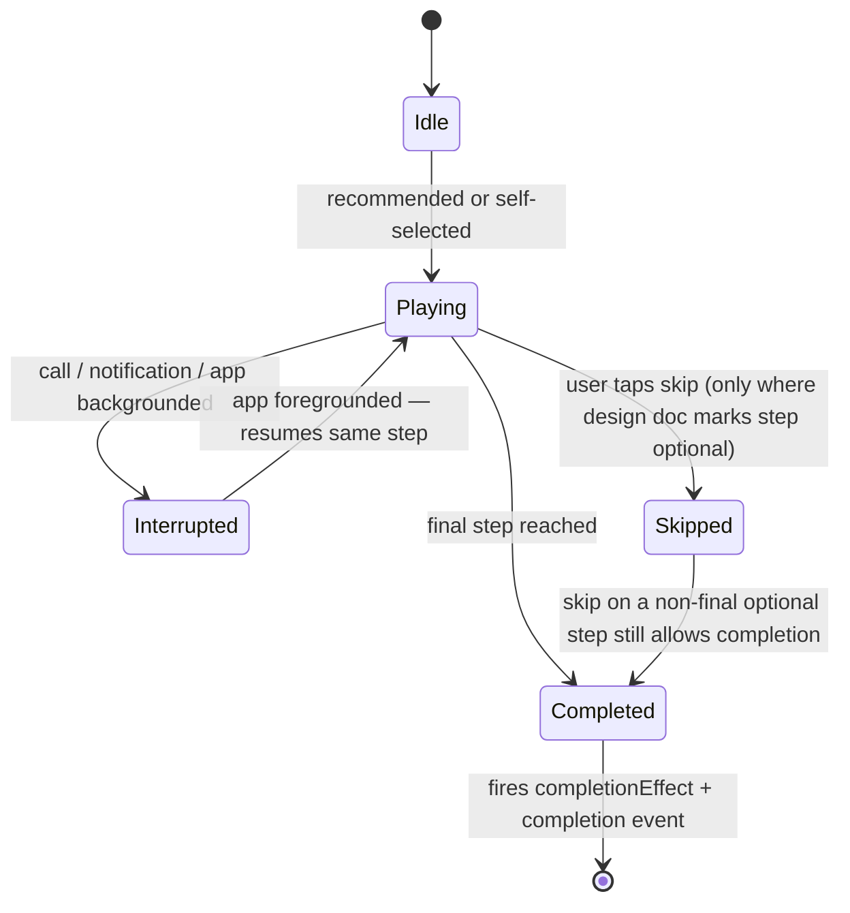
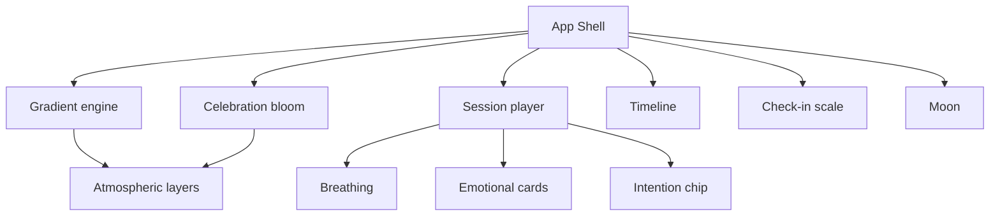
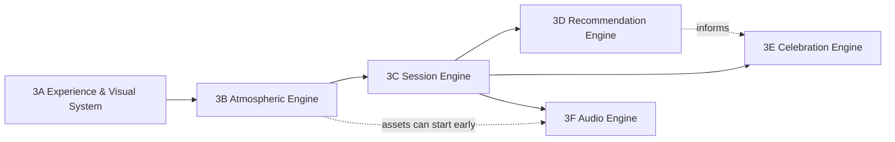

# Solas — Stage 3 Implementation Blueprint

*Architecture document. Not implementation. Source of truth for all Stage 3 sprint planning.*

**Input:** [`docs/stage-3-design-proposal.md`](./stage-3-design-proposal.md) — every decision in that document (palette, type, spacing, session durations, the six emotional design principles, "no streaks/badges/gamification") is preserved and treated as a constraint here, not re-litigated.

**Purpose of this document:** the design proposal describes *what Solas should feel like*. This document describes *the systems that produce that feeling* — five engines, a component library, an asset structure, a state architecture, and a sprint sequence a team can actually execute against.

---

## 0. System Overview

Solas's experience is produced by five engines that each own one concern and communicate through a small, explicit surface — not a shared blob of state. The Emotional Engine is the only one that infers *how someone feels*; every other engine only ever consumes that inference, never re-derives it independently.



**Reading this diagram:** the Emotional Engine is upstream of everything — it never renders anything itself. The Environmental Engine is downstream of both the clock and the Emotional Engine, because atmosphere is time-of-day *tinted by* feeling, never the other way around. The Recommendation Engine only ever hands the Session Engine a sequence to run; it never renders UI directly. The Session Engine is the only engine that reports completion — that single event is what both closes the emotional loop and feeds the Celebration Engine's milestone detection.

**Independence, precisely defined:** "five independent systems" means each engine can be built, tested, and reasoned about in isolation, with a typed input/output contract — not that they're unaware of each other. The contracts are deliberately narrow (see §9, State Architecture) so a change inside one engine's internals never requires a change inside another's.

---

## 1. Emotional Engine

The only engine allowed to infer feeling. Its output is **never rendered to the user as a label, score, or stat** — no screen ever says "You seem stressed" or shows an emotion badge. It exists purely to inform what the other four engines do next. This is a structural guardrail, not a style guideline: the engine's public output type has no string/number field intended for direct display (see §9).

### 1.1 States

Eight states, organized by what they need, not by valence alone — this is what makes the transition table in §1.2 coherent rather than arbitrary:

| Family | States | What they need |
|---|---|---|
| Baseline | **calm** | Nothing — the resting default |
| Activated | **stressed**, **overwhelmed**, **restless** | Down-regulation (breathing, grounding) |
| Depleted | **tired**, **lonely** | Warmth, low effort, connection-adjacent content |
| Ascending | **hopeful**, **grateful** | Reinforcement, not intervention |

### 1.2 Transitions

States are not switched by the user picking a label — they move as a consequence of what happens (or doesn't) in a session. Every state has exactly one "resolves via" path, so the Recommendation Engine (§4) always has an unambiguous ritual to reach for.



**Decay:** any non-`calm` state with no reinforcing signal for **72 hours** decays one step toward `calm` (Activated/Ascending states step down through their family before reaching calm; `overwhelmed` always steps down through `stressed` first, never jumps straight to `calm` — a real down-regulation has to be felt, not assumed).

### 1.3 Triggers

No diagnostic questionnaire — every design proposal principle about "very little text" and "avoid long questionnaires" applies here too. Signals are cheap and mostly passive:

| Trigger | Signal type | Maps to |
|---|---|---|
| Weekly check-in scale (§7 of design doc) | Explicit, 1 gesture | Cool end → stressed/overwhelmed candidate · warm end → hopeful/grateful candidate · middle → calm/restless (disambiguated by recency of last session) |
| Onboarding intention card | Explicit, 1 tap | Initial anchor only — sets a starting bias, not a diagnosis |
| 3+ evenings without a breathing session | Implicit, session history | stressed candidate (mirrors the exact example already in the design doc's Recommendation Flow) |
| Session abandoned mid-way (breath/grounding) | Implicit, session event | overwhelmed candidate (intensity +1) |
| Return after absence ≥ 7 days | Implicit, timestamp gap | lonely candidate |
| App opened well outside their stated wake/bed window | Implicit, rhythm data | tired or restless candidate, disambiguated by time direction |
| Panic-mode entry point tapped | Explicit, 1 tap, always available | overwhelmed, intensity 3, immediate |

### 1.4 Priorities

When two signals disagree in the same window, the more urgent family wins. Order (highest to lowest):

`overwhelmed` → `stressed` → `restless` → `lonely` → `tired` → `hopeful` → `grateful` → `calm`

Rationale: Activated states are safety-adjacent and always take precedence for triggering support; Ascending states never need to "win" a conflict because reinforcing them a session late costs nothing, while missing a `stressed` signal does.

### 1.5 Intensity

Every non-decayed state carries an internal intensity of **1–3** (mild / moderate / acute). Never surfaced numerically or as a progress bar — it only changes *which* session length/variant the Recommendation Engine reaches for (a mild `stressed` gets a 60s breathing session; an acute one gets the extended Panic Mode variant). Intensity 3 on `overwhelmed` is the sole automatic trigger for surfacing the Panic Mode entry point more prominently (still never a red/alarming treatment — see design doc §12, "no red anywhere").

### 1.6 Fallback

`calm` is the universal fallback: no signal, a stale signal past its decay window, or a signal the engine can't confidently classify all resolve to `calm`. The engine is built to never leave the product "stuck" describing someone as `stressed` indefinitely from one weekly check-in three weeks ago.

---

## 2. Environmental Engine

Everything visible that isn't a component is the Environmental Engine. It has **one continuous base layer** (Gradient) and six **conditional layers** that composite on top of it. Nothing here is a toggleable "theme" — every layer is driven by time, emotional tint, or a specific session/celebration event.

### 2.1 The base: Gradient (dawn / daylight / dusk / moonlight)

Dawn, Daylight, Dusk, and Moonlight are **not four separate layers** — they are the four anchor stops of one continuous 24-hour gradient timeline that the Gradient layer interpolates between in real time, exactly matching the design proposal's "sky continuity" animation principle (§10 of the design doc: gradients animate across screen boundaries, never cut).

| Anchor | Approx. window | Palette pull |
|---|---|---|
| Moonlight | 20:00–05:00 | Ink → Dusk → Moonlight accent |
| Dawn | 05:00–08:00 | Dusk → Dawn accent |
| Daylight | 08:00–17:00 | Dawn → neutral-light desaturated pull (daylight is the *quietest* part of the gradient — the app recedes during the day, per the design doc's "Silence" journey step) |
| Dusk | 17:00–20:00 | Daylight → Moonlight, warming through Ember briefly at the center |

**Emotional tint:** the Emotional Engine's current state nudges saturation and contrast, never hue family — `overwhelmed`/`stressed` desaturate and deepen slightly (a quieter sky, not a darker warning), `hopeful`/`grateful` lift saturation marginally. This is a ±8% adjustment, intentionally subtle enough that it's felt, not noticed.

### 2.2 Conditional layers

| Layer | Appears during | Behavior | Tier |
|---|---|---|---|
| **Clouds** | Daylight, Dusk | Slow horizontal drift (90–150s crossing), translucent, 2–4 on screen max. Density/speed responds to `restless` (more, faster) vs `calm` (fewer, slower/absent) | 1 |
| **Stars** | Moonlight only | Sparse (12–20), gentle twinkle (opacity pulse, 3–6s, staggered). Density doubles briefly during a Celebration bloom | 1 |
| **Mist** | `overwhelmed` sessions (grounding, panic mode) only | Low-opacity horizontal fog band, soft edges, no motion beyond a very slow drift — visual metaphor for softening hard edges, never ambient/everyday | 2 |
| **Rain** | Anxiety / stress support sessions only, paired with audio | Fine vertical particle streaks, low density, always paired with the ambient rain audio cue — never silent, never decorative-only | 2 |
| **Particles** | Breath cycles, gratitude save, celebration bloom | Always event-triggered, never continuously ambient. Rising motes timed to the 4s-in/6s-out breath rhythm; a small confirm burst on gratitude save; radiating motes on bloom | 2 |
| **Aurora** | Celebration bloom, Moonlight window only | A slow soft sweep of color across the upper sky, reserved *exclusively* for Celebration Engine triggers — appearing anywhere else would cheapen it | 3 |

### 2.3 Compositing order (back to front)

`Gradient → Clouds → Stars → Mist/Rain (session-specific) → Aurora (celebration-only) → Particles → UI/Components`

### 2.4 Performance tiers

A device or a `prefers-reduced-motion` context can render Tier 0 only and still be a complete, correct experience — nothing above Tier 0 carries information the person can't get another way (matches design doc §14, Accessibility: decorative layers are marked decorative).

| Tier | Includes | Required on |
|---|---|---|
| 0 | Gradient only (can freeze-frame under reduced motion) | All devices, always |
| 1 | + Clouds, Stars | Default target |
| 2 | + Mist, Rain, Particles | Session-specific, mid-tier+ devices |
| 3 | + Aurora | Celebration-only, highest-tier devices |

---

## 3. Session Engine

A **catalog of standalone session modules**, not a fixed script. Every session shares one schema so the Session Player component (§7) can run any of them identically, and so the Recommendation Engine (§4) can sequence them without needing to know their internals.

### 3.1 Session schema

| Field | Description |
|---|---|
| `id` | Unique session identifier |
| `category` | `morning` \| `evening` \| `support` |
| `steps` | Ordered list of screens (each maps 1:1 to a screen already specified in the design proposal) |
| `durationRange` | Min–max seconds, from the design doc's per-screen durations |
| `entryStates` | Which Emotional Engine states make this session eligible for recommendation |
| `environmentalLayers` | Which Environmental Engine layers this session requests while active |
| `interruptible` | Always `true` — every session resumes at the same step, never restarts (design doc §15) |
| `completionEffect` | Which emotional state transition firing this session's completion triggers |

### 3.2 Morning sessions

| Session | Steps (from design doc) | Duration | Entry states |
|---|---|---|---|
| **Awakening** | Wake | 5–10s | Always (the entry point to the morning ritual) |
| **Stretching** | Stretch (optional) | 60–120s | calm, tired |
| **Grounding** | Stretch-equivalent slot, grounding variant | 60–120s | restless, overwhelmed *(swapped in by the Recommendation Engine instead of Stretching)* |
| **Intention** | Intention, Begin | 15–20s | Always |

### 3.3 Evening sessions

| Session | Steps (from design doc) | Duration | Entry states |
|---|---|---|---|
| **Gratitude** | Gratitude | 20–45s | calm, lonely, grateful |
| **Reflection** | *Gratitude variant, prompt swapped from "one thing" to "how the day sat with you"* | 20–45s | stressed, overwhelmed *(precedes Breathing rather than following it)* |
| **Breathing** | Breath | 60–90s | stressed, overwhelmed, restless |
| **Sleep preparation** | Goodnight | 5s | Always (the ritual's close) |

### 3.4 Support sessions

Not part of the ordinary morning/evening rhythm — entered directly from a check-in acknowledgement, a recommendation, or (Panic Mode) a persistent quiet entry point.

| Session | Purpose | Duration | Notes |
|---|---|---|---|
| **Anxiety** | Down-regulate acute activation | 90–120s | Rain layer + audio, extended breath pacing (5s in / 7s out) |
| **Stress** | Standard down-regulation | 60–90s | Standard breathing session, reused from Evening catalog |
| **Loneliness** | Connection-adjacent warmth | 30–45s | A single warm, specific line + gratitude prompt — never a social/community feature, stays private |
| **Panic mode** | Immediate acute support | Uncapped, self-paced | See §3.5 |

### 3.5 Panic Mode — special case

The single highest-priority entry point in the product. Design constraints, all directly inherited from the design proposal's own principles:

- Reachable in **one tap from anywhere**, including mid-session — a quiet, permanent, non-alarming affordance, never styled as an emergency/red control (design doc §12: no red anywhere).
- On entry: **zero navigation, zero copy beyond one reassuring line**, straight into an extended breathing session (5s in / 7s out).
- **No exit friction** — a single, always-visible way out at any point, no confirmation dialog.
- Does not require or record an emotional check-in to enter — entering *is* the signal.
- Completion effect: `overwhelmed` → `stressed` (never claims to fully resolve acute distress in one session — see the transition table's honesty about `overwhelmed` always stepping down through `stressed`, never jumping to `calm`).

### 3.6 Session lifecycle



---

## 4. Recommendation Engine

Never renders UI. Its only job: given the Emotional Engine's current output, produce an **ordered sequence of Session Engine session ids** for the Session Player to run — the pipeline requested is `emotion → recommendation → ritual → completion`, which resolves architecturally to `emotion → rule lookup → session sequence → Session Player run → completion event back to Emotional + Celebration Engines`.

### 4.1 Rule table

| Emotional state | Sequence | Matches design doc example |
|---|---|---|
| stressed | breathing → reflection → gratitude | Given verbatim |
| overwhelmed | grounding → breathing → *(completion)* | Given verbatim |
| restless | grounding → stretching | Extrapolated, same pattern |
| lonely | reflection → gratitude | Extrapolated |
| tired | sleep-preparation only *(shortest path — depleted states get less, not more)* | Extrapolated |
| hopeful | gratitude *(single reinforcing step)* | Extrapolated |
| grateful | *(no recommendation fires — ascending states are left alone)* | Extrapolated |
| calm | *(no recommendation fires — the ordinary morning/evening flow runs unmodified)* | Extrapolated |

### 4.2 Assembly rule

The engine never invents a session — it only reorders or substitutes within the existing Session Engine catalog (e.g., swapping Stretching for Grounding in the Morning flow, per §3.2). It respects `entryStates` from each session's schema as a hard filter before a sequence is ever assembled.

### 4.3 Dismissal handling

Directly from the design doc's Recommendation Flow spec ("tap away dismisses permanently for that context, no nagging repeat"): a dismissed sequence is recorded against `(emotionalState, sessionContext)` and suppressed for **14 days** or until the state changes, whichever comes first — never re-offered on every subsequent visit.

### 4.4 Completion feedback loop

On Session Player completion, the engine reads the completed session's `completionEffect` and forwards it to the Emotional Engine — the Recommendation Engine itself holds no emotional-state logic; it only relays.

---

## 5. Celebration Engine

Two tiers, deliberately unequal in weight, so that the rare tier stays rare.

### 5.1 Tiers

| Tier | Treatment | Frequency |
|---|---|---|
| **Acknowledgement** | One warm sentence, no bloom, no new environmental layer | Return-after-absence, minor recognitions |
| **Celebration** | Full bloom (Ember radial + Aurora layer, §2.2), one affirming sentence in the display serif | Milestones only — see §5.2 |

### 5.2 Triggers

| Trigger | Condition | Tier |
|---|---|---|
| First ritual | First session of any kind ever completed | Celebration |
| First week | 7 distinct calendar days with ≥1 completed session | Celebration |
| First month | 28 distinct calendar days with ≥1 completed session *(a lunar-cycle framing, deliberately not a "30-day streak")* | Celebration |
| First support session completed | First Anxiety/Stress/Loneliness/Panic Mode session completed | Celebration *(arguably more meaningful than a routine milestone — treated with equal weight)* |
| Return after absence | Reopen after a gap ≥ 7 days | Acknowledgement |

### 5.3 Guardrails against gamification

These are structural, enforced in the data model (§9), not stylistic suggestions a future screen could quietly violate:

- The engine's persisted state stores **milestone booleans and dates only** (`hasCompletedFirstRitual`, `firstWeekCompletedAt`, …) — there is no `currentStreak` or `totalSessionsCompleted` field anywhere in this engine's data shape, so one cannot be rendered even by accident.
- No badge/icon asset category exists in the asset structure (§8) — there is nowhere to put one.
- A milestone fires **once**, ever — re-crossing a threshold (e.g., a second 7-day span) never re-fires the same celebration.

---

## 6. Component Library

| Component | Purpose | Key variants | Depends on |
|---|---|---|---|
| **Moon** | Primary brand anchor; appears in nav, night scenes, celebration | Phase is decorative/time-based only (real lunar phase or gentle in-session rotation) — **never tied to usage or streak data** | Environmental Engine (time) |
| **Breathing** | The expand/contract circle | Parametrized by inhale/exhale duration, cycle count, color theme; reduced-motion (opacity-pulse) variant | Session Engine (active session's pacing) |
| **Emotional cards** | Mood/intention selection grid (onboarding, morning intention re-check) | Selectable grid, single-select | Emotional Engine (writes initial anchor) |
| **Check-in scale** | The weekly mood pulse — a *separate* component from Emotional cards, a continuous gradient drag/tap, not a grid | One continuous cool→warm gesture | Emotional Engine (primary explicit trigger source) |
| **Intention chip** | Small persistent element carrying the current intention word | Compact (Home) / expanded (Morning re-check) | Session Engine (Intention session) |
| **Gradient engine** | Renders the composited Environmental Engine stack | Tier 0–3 (§2.4) | Environmental Engine |
| **Session player** | Orchestrates a session's steps: timing, skip, interrupt/resume | Linear step runner | Session Engine, Recommendation Engine |
| **Timeline** | A private, non-social visual trace of session moments as soft dots *along the sky gradient itself* — explicitly not a chart, graph, or stats grid | Read-only, no numbers rendered | Session Engine (completion events), Environmental Engine (renders onto the gradient) |
| **Celebration bloom** | The light-burst moment | Acknowledgement (text-only) / Celebration (full bloom) | Celebration Engine, Environmental Engine (Aurora, Particles) |
| **Atmospheric layers** | Wrapper rendering Clouds/Stars/Mist/Rain/Particles/Aurora as pluggable children | Tier-gated | Environmental Engine |



---

## 7. Asset Structure

```
assets/
  audio/
    ambient/          # per-environmental-layer loops (rain, dusk wind, night quiet)
    breathing/         # inhale/exhale cue tones, per session pacing variant
    sessions/          # spoken/tonal cues per session module, by session id
    celebration/        # single sting per tier (acknowledgement / celebration)
  animation/
    breathing/          # expand-contract curve definitions
    transitions/         # screen-to-screen motion (§10 of design doc)
    bloom/              # celebration bloom sequence
  icons/
    mono/               # single-weight functional icons only — no badge/achievement set
  particles/
    breath/
    gratitude-save/
    celebration/
  gradients/
    timeofday/           # the four anchor stops + interpolation curve
    emotional-tint/       # the ±8% saturation/contrast adjustment curves per state
  illustrations/
    onboarding/
    empty-states/         # e.g. "no reflections yet" — copy-light, per design doc's "avoid walls of text"
```

No `badges/`, `achievements/`, or `streaks/` directory exists anywhere in this structure — enforced by omission, matching §5.3.

---

## 8. State Architecture

Five domains, each with a clear owner. No engine reaches into another engine's domain directly — every cross-engine communication is one of the labeled arrows in §0's diagram.

| Domain | Owner | Scope | Example shape |
|---|---|---|---|
| **Global state** | App shell | Auth/guest identity, current route, theme (light/dark), reduced-motion preference | `{ identity, route, theme, reducedMotion }` |
| **Session state** | Session Engine | The currently-playing session: which step, elapsed time, interrupted flag | `{ sessionId, stepIndex, startedAt, interrupted }` |
| **Emotion state** | Emotional Engine | Current state, intensity, timestamp of last reinforcing signal | `{ state, intensity, lastSignalAt }` |
| **User state** | Cross-cutting (persisted) | Wake/bed time, intention, milestone booleans, dismissal records | `{ wakeTime, bedTime, intention, milestones, dismissals }` |
| **Animation state** | Component-local (Gradient, Breathing, Bloom) | Current tier, active layers, in-flight transition | `{ tier, activeLayers, transitionPhase }` |

**Persistence note:** this blueprint is architecture-layer and backend-agnostic. Where Stage 2B's existing Supabase tables already model a concept (`user_intentions` ↔ the Intention session and chip; `journal_entries` ↔ the Gratitude/Reflection sessions), Stage 3 should read/write through those same tables rather than introducing parallel storage — but no new schema is proposed here, per this task's explicit scope.

---

## 9. Sprint Planning

### 9.1 Phase sequence and dependencies



Not strictly linear: **3F's asset pipeline can begin as soon as 3B's layer list is final**, running in parallel with 3C/3D — audio is usually the bottleneck resource, so starting it late is the single biggest schedule risk (see risks below).

### 9.2 Phase breakdown

**Phase 3A — Experience & Visual System**
- Scope: design tokens (palette, type, spacing from the design doc) as an actual theme layer; Moon, Gradient (Tier 0 only), Breathing (static) components; base layout shell.
- Depends on: design proposal (complete).
- Deliverable: a themeable shell that renders the correct sky color for the current time of day, with no session logic yet.
- Risk: scope creep into session behavior before the visual foundation is locked — hold the line at Tier 0.

**Phase 3B — Atmospheric Engine**
- Scope: full layered Environmental Engine (§2) — Clouds, Stars, Mist, Rain, Particles, Aurora; performance tiering; reduced-motion variants.
- Depends on: 3A's Gradient/Moon components.
- Deliverable: the complete atmospheric stack, tier-gated, independently demoable without any session attached.
- Risk: performance on low-end devices — the tiering system must be load-bearing from day one, not retrofitted.

**Phase 3C — Session Engine**
- Scope: Session Player orchestrator; all Morning/Evening/Support session modules (§3); interruption-safety; session lifecycle.
- Depends on: 3B (sessions request atmospheric layers), 3A (Breathing component).
- Deliverable: every session in the catalog playable end-to-end, self-selected (no recommendation logic yet).
- Risk: largest phase by surface area (12 session modules + Panic Mode); consider sub-phasing by category (Morning → Evening → Support) if timeline pressure appears.

**Phase 3D — Recommendation Engine**
- Scope: Emotional Engine (§1) full state machine; Recommendation rule table (§4); wiring into Session Engine's sequencing.
- Depends on: 3C — the engine can only recommend sessions that already exist and are playable.
- Deliverable: the `stressed`/`overwhelmed` example paths (and the rest of the rule table) live end-to-end.
- Risk: emotional-state inference is a heuristic on day one, not a model — ship the rule table as specified in §1.3/§4.1 and expect it to be tuned against real usage rather than perfected up front.

**Phase 3E — Celebration Engine**
- Scope: milestone detection (§5.2); Acknowledgement/Celebration tiers; Celebration Bloom component wiring into Aurora/Particles.
- Depends on: 3C (needs completion events to detect milestones), loosely informed by 3D (a first-support-session-completed milestone needs Recommendation Engine or direct support-session entry to exist).
- Deliverable: all five triggers firing correctly, exactly once each.
- Risk: gamification creep is the real risk here, not engineering difficulty — every PR against this phase should be checked against §5.3's guardrails explicitly, not assumed.

**Phase 3F — Audio Engine**
- Scope: ambient soundscapes per environmental layer; breathing-paced audio cues; session audio; celebration sting.
- Depends on: 3B (layer list must be final before ambient audio is scoped), 3C (session timing drives cue placement).
- Deliverable: audio layered onto every session and every atmospheric layer from §2.2/§3.
- Risk: asset creation/licensing is typically the longest lead time in the whole plan — **start the asset pipeline at the beginning of 3B**, not at the start of 3F, even though integration work waits until later.

### 9.3 Cross-phase risks

| Risk | Affects | Mitigation |
|---|---|---|
| Audio asset lead time | 3F, indirectly all phases' "finished" feel | Start sourcing/commissioning at 3B kickoff |
| Low-end device performance | 3B, 3C | Tier system must be enforced in code review, not left as a "nice to have" |
| Emotional inference feels wrong to real users | 3D | Ship the heuristic rule table, instrument completion effects, revisit after real usage data — do not attempt a "smarter" model before shipping the simple version |
| Gamification creep | 3E, and any future phase touching Timeline/Home | Treat §5.3 and the asset-structure omission (§7) as hard review gates |
| Session module count underestimated | 3C | Sub-phase by category if needed; Panic Mode should not be delayed regardless of sub-phasing |

---

## 10. Deliverables Checklist

- [x] Architecture diagram (§0)
- [x] Component hierarchy (§6)
- [x] Data models — as schema tables throughout §1–§8, not executable code, per this task's scope
- [x] Asset structure (§7)
- [x] State diagrams — Emotional transitions (§1.2), Session lifecycle (§3.6)
- [x] Implementation sequence (§9.1)
- [x] Dependencies (§9.1, §9.2 per-phase)
- [x] Risks (§9.3, plus per-phase in §9.2)
- [x] Sprint breakdowns (§9.2)

---

## Appendix A — Navigation & Layout Shell Specification (Phase 3A, Ticket Group 5)

*Added during Phase 3A implementation (MLT-3A-11, 12, 13). This is specification and validation only — `src/components/Layout.jsx` was not modified to produce this appendix, and nothing here changes Stage 2's live navigation or layout behaviour. It exists so later integration work has an explicit rulebook to build against, rather than re-deriving these rules from the design proposal each time.*

### A.1 Content shell
- Single column throughout; maximum content width ~420px (design proposal §13).
- Minimum horizontal margins 24–32px at every screen edge, before any component's own padding (design proposal §13).
- Safe-area treatment: any future full-bleed ritual screen must pad against `env(safe-area-inset-*)` on all four edges. **Gap noted, not fixed here**: `Layout.jsx` does not currently apply safe-area insets anywhere — flagged for whichever ticket eventually touches it (see A.7).
- Vertical rhythm: spacing between content blocks uses the approved 8-point scale (A.5) — never an arbitrary gap value.
- Full-screen ritual exception: a screen that *is* a ritual (a future Morning/Evening/Support session, or any full-bleed Gradient moment) is expected to bypass the 420px cap and persistent chrome entirely — by reusing the **existing** `hideNavigation` route-list mechanism already in `Layout.jsx` (the same pattern `alarm-trigger`, `onboarding`, `session-complete`, etc. already use today), not a new mechanism invented for Stage 3.

### A.2 Thumb-zone rules
- Primary actions anchor in the lower third of the viewport (design proposal §15).
- Minimum touch target 56px; the one primary action on a screen gets 64px+ (design proposal §13, blueprint §6).
- Never a primary action in the top-right.
- One dominant action per screen — the same "one action per screen" principle that governs everything else in Stage 3 (design proposal principle 2).

### A.3 Navigation rules
- Existing Stage 2 navigation — the four-item bottom nav (Today/Routines/Journey/Profile), header, theme toggle, audio player strip — remains **completely unchanged** through all of Phase 3A. Confirmed unchanged by the visual regression pass in this ticket group's final report.
- A future Stage 3 ritual screen may hide navigation when intentionally full-screen, exactly the way existing Stage 2 full-screen flows already do via `hideNavigation` — not a new opt-out mechanism.
- Navigation transitions must not interrupt Gradient continuity — when a future integration moves between a nav-visible screen and a full-bleed ritual screen, the sky should read as continuous (design proposal §10's "sky continuity" principle), not a hard cut. This is a rule for whichever future ticket performs that integration; nothing today exercises this path since no real screen consumes `Gradient` yet.
- No additional bottom-nav tabs without a separate, explicit approval.
- No "Discover" tab, notification badge, or algorithmic recommendation feed — direct carry-over from the Recommendation Flow's explicit exclusions in the design proposal.

### A.4 Typography rules
- Newsreader (serif, italic) is reserved for felt moments only — onboarding, intention, celebration (design proposal §11). It must never be used for navigation labels, buttons, or other structural UI.
- The existing structural sans (Plus Jakarta Sans) remains fully operational for all existing Stage 2 UI — unchanged, since it already is the default today.
- Line length caps at ~60 characters for felt/body text (design proposal §11).
- Text must reflow at any OS dynamic-type/font-scaling setting without truncation, preserving the one-screen-one-message layout (design proposal §14). A rule for future integration work — nothing today has real content to reflow.

### A.5 Spacing rules
- The approved 8-point scale is 4 / 8 / 16 / 24 / 32 / 48 / 64 / 96 (design proposal §13, blueprint §6).
- **No new spacing tokens are needed.** Tailwind's default spacing scale is itself 4px-based, so steps `1, 2, 4, 6, 8, 12, 16, 24` already land exactly on `4, 8, 16, 24, 32, 48, 64, 96px`. The rule is therefore: use only Tailwind spacing utilities at those specific steps — never an arbitrary value (e.g. `p-[13px]`) and never an off-scale default step (`3, 5, 7, 9, 10, 11...`).
- Screen/card padding: 24–32px outer padding (`px-6`/`px-8`), matching what `Stage3Preview.jsx` already does.
- Favour more negative space than a typical dashboard; content density is deliberately low.
- No dashboard-style dense multi-card grids anywhere in Stage 3 UI.

### A.6 Accessibility
- Safe areas: see A.1 — a known gap, not yet implemented anywhere, flagged for future integration.
- Large touch targets: 56/64px minimum, per A.2.
- Keyboard/focus behaviour: every future interactive element needs a visible focus state. Not currently exercised — `Moon`, `Gradient`, and `Breathing` are non-interactive/decorative by default today.
- Dynamic type: see A.4.
- Screen-reader order: DOM order must match visual/reading order. Already followed by the three built components.
- Reduced-motion compatibility: every Stage 3 component must respect `prefers-reduced-motion`. Live-verified for `Gradient`, `Moon`, and `Breathing` in this ticket group — see the Group 5 final report.

### A.7 Integration boundary

**Recommendation: a separately approved integration ticket after Phase 3C's components are stable — not folded into Phase 3C itself.**

Reasoning:
1. `Layout.jsx` is shared, load-bearing infrastructure for every existing Stage 2 screen — exactly the kind of high-blast-radius file this whole Phase 3A effort has been deliberately careful never to touch without its own isolated review cycle (the additive-token-only strategy throughout Groups 1–4, and the explicit "do not modify Layout.jsx" instruction repeated in every one of them).
2. Phase 3C is already the largest phase by ticket count and complexity in the workbook (§9.2: "Very High," 20 tickets). Folding navigation-shell integration into it risks the exact scope-creep the workbook's own risk register warns about (R-08) and would blur 3C's acceptance criteria.
3. A dedicated integration ticket can be reviewed against the *complete, stable* set of Stage 3 components — Moon, Gradient, Breathing, plus whatever 3B's atmospheric layers and 3C's session player end up looking like — rather than against a partially-built 3C, reducing the chance `Layout.jsx` needs to be revisited twice.

This recommendation does not modify the workbook's phase scope on its own — it's a recommendation for whoever plans the 3C→3D transition to act on explicitly.

---

*This document is the master blueprint for Stage 3 development. Before any future addition to Solas — a new session type, a new environmental layer, a new celebration trigger — check it against the engine it belongs to and the guardrails in §5.3 and §1 before building.*
