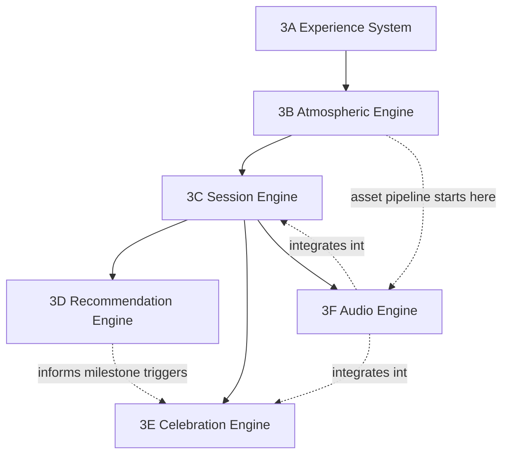

# Solas — Stage 3 Project Management Workbook

*Single source of truth for all Stage 3 implementation work. Nothing in the linked design/architecture documents is re-designed here — this workbook only sequences and tickets the work they already specify.*

**Inputs (authoritative, unmodified):**
[`docs/stage-3-design-proposal.md`](./stage-3-design-proposal.md) · [`docs/stage-3-implementation-blueprint.md`](./stage-3-implementation-blueprint.md)

> **A note on format.** This workbook is structured to resemble the HalalScanner project's tracking conventions (`docs/project-tracking.md`) — a Master Register, per-phase worksheets, a Dashboard, and phase-ticket IDs. HalalScanner's own tracking file records that no standalone external "workbook" document was ever locally reachable in that project either (Google Drive access unavailable at the time); this document takes the same honest approach — it *is* the workbook, built in-repo, rather than a stand-in for one that exists somewhere else. Reconcile against any other planning system your team already runs (Jira, Linear, etc.) by importing the Master Register in §4 as-is; the ticket IDs are stable and meant to survive that move.

---

## 0. Conventions

| Convention | Value |
|---|---|
| Ticket ID format | `MLT-<phase>-<sequence>`, e.g. `MLT-3A-04` |
| Epic ID format | `MLT-<phase>-E<n>`, e.g. `MLT-3A-E2` |
| Priority | `P0` blocking / critical path · `P1` important, not blocking · `P2` polish, deferrable |
| Effort | Story points, Fibonacci (1/2/3/5/8/13) |
| Status values | `Not started` · `In Progress` · `Awaiting QA` · `Blocked` · `Completed` |
| Sprint length assumed | 2 weeks |
| Risk references | `R-01`…`R-08`, defined in §6 |
| Testing type references | `T-UNIT` `T-INT` `T-A11Y` `T-PERF` `T-INTR` `T-RM` `T-AND` `T-IOS`, defined in §5 |

---

## 1. Executive Summary

Stage 3 turns Solas from a persistence layer (Stage 2B) into an experience — five engines (Emotional, Environmental, Session, Recommendation, Celebration) plus a shared component library, built in six phases. Phases 3A and 3B establish the visual and atmospheric foundation nothing else can be built without. 3C is the largest phase by surface area (twelve session modules plus Panic Mode) and is the first phase where the product becomes actually usable end-to-end in self-selected form. 3D layers emotional inference and recommendation on top of an already-working session catalog — deliberately sequenced *after* 3C so the Recommendation Engine never has to recommend a session that doesn't exist yet. 3E adds celebration, explicitly guarded against the gamification patterns (streaks, badges, percentage bars) both source documents rule out structurally, not just stylistically. 3F, audio, has the longest real-world lead time in the plan (asset sourcing/licensing) and should begin its asset pipeline during 3B rather than waiting for its own phase to start.

No schema changes are proposed in this workbook. Where a phase's data needs (persisted emotional-state history, milestone flags) will eventually require new tables, that is flagged explicitly in the phase's Deployment Requirements as **schema TBD — requires a separate, approved migration proposal**, following this project's established Stage 2B pattern (migration proposed and reviewed before any execution, never auto-applied).

---

## 2. Roadmap / Delivery Phases

| Phase | Name | Epics | Tickets | Total effort (pts) | Complexity | Target sprint window |
|---|---|---|---|---|---|---|
| 3A | Experience System | 5 | 15 | 61 | High | Sprints 1–2 |
| 3B | Atmospheric Engine | 6 | 18 | 76 | Very High | Sprints 3–4 |
| 3C | Session Engine | 6 | 20 | 97 | Very High | Sprints 5–7 |
| 3D | Recommendation Engine | 6 | 17 | 68 | High | Sprints 8–9 |
| 3E | Celebration Engine | 4 | 12 | 44 | Medium | Sprints 10 |
| 3F | Audio Engine | 5 | 14 | 52 | Medium–High | Sprints 6–11 (asset pipeline starts Sprint 3) |

**Total:** 32 epics, 96 tickets, ~398 story points across roughly **11 sprints / ~22 weeks**, assuming 3F's integration work overlaps 3C–3E as planned.

---

## 3. Dependency Diagram

Only 3A→3B→3C is a hard, strictly linear dependency chain. 3D and 3E both branch from 3C and can run in either order relative to each other (3E only loosely depends on 3D for one milestone type — first-support-session-completed). 3F's *asset sourcing* should start at 3B; its *integration* work threads through 3C, then 3E.

---

## 4. Master Register

*The single table to check for current status of any piece of Stage 3 work. Detail for each ticket lives in the phase worksheets (§7–§12).*

| Ticket | Title | Epic | Priority | Effort | Status |
|---|---|---|---|---|---|
| MLT-3A-01 | Design token module (colour, type, spacing) | 3A-E1 | P0 | 5 | Completed |
| MLT-3A-02 | Dark/light theme resolution | 3A-E1 | P0 | 3 | Completed |
| MLT-3A-03 | Typography scale implementation | 3A-E1 | P1 | 3 | Completed |
| MLT-3A-04 | Gradient timeline (dawn/day/dusk/moonlight interpolation) | 3A-E2 | P0 | 8 | Completed |
| MLT-3A-05 | Emotional tint hook on gradient (±8%) | 3A-E2 | P2 | 3 | Deferred — not built; discrete-anchor-with-cross-fade approved for Phase 3A instead (see Group 2 report) |
| MLT-3A-06 | Moon component — base render | 3A-E3 | P0 | 5 | Completed |
| MLT-3A-07 | Moon component — phase/rotation logic (decorative only) | 3A-E3 | P1 | 3 | Completed |
| MLT-3A-08 | Breathing component — core animation | 3A-E4 | P0 | 5 | Completed |
| MLT-3A-09 | Breathing component — parametrization (duration/cycles/theme) | 3A-E4 | P1 | 3 | Completed |
| MLT-3A-10 | Breathing component — reduced-motion variant | 3A-E4 | P0 | 2 | Completed — includes a Group 5 fix: halo previously still scaled under reduced motion, now opacity-only |
| MLT-3A-11 | Single-column layout shell | 3A-E5 | P0 | 5 | Specification complete, integration deferred (blueprint Appendix A.1) |
| MLT-3A-12 | Thumb-zone navigation pattern | 3A-E5 | P0 | 5 | Specification complete, integration deferred (blueprint Appendix A.2) |
| MLT-3A-13 | One-navigation-depth routing guard | 3A-E5 | P1 | 3 | Specification complete, integration deferred (blueprint Appendix A.3) |
| MLT-3A-14 | 8pt spacing scale + touch-target audit | 3A-E1 | P1 | 2 | Completed |
| MLT-3A-15 | Design-token visual regression baseline | 3A-E1 | P2 | 3 | Completed |
| MLT-3A-16 | Isolated Stage 3 preview route (new, approved) | 3A-E1 | P1 | 2 | Completed |
| MLT-3B-01 | Cloud layer — render & drift | 3B-E1 | P1 | 5 | Completed |
| MLT-3B-02 | Cloud layer — emotional density/speed response | 3B-E1 | P2 | 3 | Not started |
| MLT-3B-03 | Star layer — render & twinkle | 3B-E2 | P1 | 5 | Completed |
| MLT-3B-04 | Star layer — celebration density boost | 3B-E2 | P2 | 2 | Not started |
| MLT-3B-05 | Mist layer | 3B-E3 | P1 | 5 | Completed |
| MLT-3B-06 | Rain layer + audio hook | 3B-E3 | P1 | 5 | Completed — visual layer only; audio hook explicitly out of scope, not built |
| MLT-3B-07 | Particle system core (event-triggered engine) | 3B-E4 | P0 | 8 | Completed |
| MLT-3B-08 | Breath-cycle particles | 3B-E4 | P1 | 3 | Completed — animation built; no real Session Engine trigger wired yet |
| MLT-3B-09 | Gratitude-save particle burst | 3B-E4 | P2 | 2 | Completed — animation built; no real Gratitude flow trigger wired yet |
| MLT-3B-10 | Celebration particle burst | 3B-E4 | P1 | 3 | Completed — animation built; no real Celebration Engine trigger wired yet |
| MLT-3B-11 | Aurora layer (celebration-exclusive) | 3B-E5 | P1 | 8 | Completed — visual layer built; real trigger (celebration/milestone/reflection) not wired, Stage3Preview manual override only |
| MLT-3B-12 | Aurora — gating so it renders nowhere else | 3B-E5 | P0 | 2 | Completed |
| MLT-3B-13 | Performance tier system (Tier 0–3) | 3B-E6 | P0 | 8 | Completed |
| MLT-3B-14 | Device capability detection & auto-tiering | 3B-E6 | P1 | 5 | Completed |
| MLT-3B-15 | Reduced-motion variants — all layers | 3B-E6 | P0 | 5 | Completed |
| MLT-3B-16 | Layer compositing order enforcement | 3B-E1 | P1 | 3 | Completed |
| MLT-3B-17 | Atmospheric layer performance instrumentation | 3B-E6 | P2 | 3 | Not started |
| MLT-3B-18 | Environmental Engine public API (layer request surface) | 3B-E1 | P0 | 5 | Completed |
| MLT-3C-01 | Session schema & catalog registry | 3C-E1 | P0 | 5 | Completed — one continuous `morning-routine` session (7 steps), not the blueprint's four-module split; see sessionDefinitions.js "WHY ONE SESSION, NOT FOUR" |
| MLT-3C-02 | Session Player — step runner core | 3C-E1 | P0 | 8 | Completed for the morning flow only — reducer/context built (Group 2); as of Group 3D Batch D, the Session Engine is the *primary* navigation source in Layout.jsx while a morning session is `playing`, with legacy `journeyStep` retained as a temporary fallback (rollback safety, not yet retired). Evening/Support/Panic Mode session types not started |
| MLT-3C-03 | Session Player — skip handling | 3C-E1 | P1 | 3 | Not started as a generic Player mechanism — each morning page's own pre-existing Skip button now additionally mirrors into the Session Engine (SKIP_STEP/ABANDON_SESSION), but there is no shared, session-type-agnostic skip runner |
| MLT-3C-04 | Awakening session | 3C-E2 | P0 | 5 | Not started as a standalone module — alarm/start/affirmation steps exist only as part of the single `morning-routine` session (see MLT-3C-01) |
| MLT-3C-05 | Stretching session | 3C-E2 | P1 | 3 | Not started as a standalone module — see MLT-3C-04 note |
| MLT-3C-06 | Grounding session (morning variant) | 3C-E2 | P1 | 3 | Not started as a standalone module — see MLT-3C-04 note |
| MLT-3C-07 | Intention session (set + re-check) | 3C-E2 | P0 | 5 | Not started as a standalone module — see MLT-3C-04 note |
| MLT-3C-08 | Gratitude session | 3C-E3 | P0 | 5 | Not started |
| MLT-3C-09 | Reflection session | 3C-E3 | P1 | 3 | Not started |
| MLT-3C-10 | Breathing session (evening) | 3C-E3 | P0 | 5 | Not started |
| MLT-3C-11 | Sleep-preparation session | 3C-E3 | P1 | 2 | Not started |
| MLT-3C-12 | Anxiety support session | 3C-E4 | P1 | 5 | Not started |
| MLT-3C-13 | Stress support session | 3C-E4 | P1 | 3 | Not started |
| MLT-3C-14 | Loneliness support session | 3C-E4 | P2 | 3 | Not started |
| MLT-3C-15 | Panic Mode — global entry point | 3C-E5 | P0 | 8 | Not started |
| MLT-3C-16 | Panic Mode — extended breathing runtime | 3C-E5 | P0 | 5 | Not started |
| MLT-3C-17 | Panic Mode — zero-friction exit | 3C-E5 | P0 | 2 | Not started |
| MLT-3C-18 | Interruption handling — call/notification | 3C-E6 | P0 | 8 | Not started |
| MLT-3C-19 | Interruption handling — app backgrounding | 3C-E6 | P0 | 5 | Not started |
| MLT-3C-20 | Session completion event bus | 3C-E1 | P0 | 5 | Partially completed — `completionEventId` is minted idempotently on `COMPLETE_SESSION` (verified once-only under StrictMode double-invoke); no actual event bus or consumers exist yet (Stage 3D Recommendation Engine dependency, MLT-3D-16) |
| MLT-3D-01 | Emotional state data model (8 states, 4 families) | 3D-E1 | P0 | 5 | Not started |
| MLT-3D-02 | Non-display guardrail (state never rendered as label) | 3D-E1 | P0 | 2 | Not started |
| MLT-3D-03 | Check-in scale component wiring | 3D-E2 | P0 | 5 | Not started |
| MLT-3D-04 | Implicit signal collectors (session history, rhythm, absence) | 3D-E2 | P1 | 8 | Not started |
| MLT-3D-05 | Onboarding intention anchor wiring | 3D-E2 | P2 | 2 | Not started |
| MLT-3D-06 | Transition state machine | 3D-E3 | P0 | 8 | Not started |
| MLT-3D-07 | 72-hour decay-to-calm scheduler | 3D-E3 | P1 | 5 | Not started |
| MLT-3D-08 | Signal priority resolver | 3D-E3 | P1 | 3 | Not started |
| MLT-3D-09 | Intensity model (1–3) | 3D-E4 | P1 | 3 | Not started |
| MLT-3D-10 | Intensity-driven session-variant selection | 3D-E4 | P1 | 5 | Not started |
| MLT-3D-11 | Recommendation rule table engine | 3D-E5 | P0 | 8 | Not started |
| MLT-3D-12 | Ritual sequence assembly | 3D-E5 | P0 | 5 | Not started |
| MLT-3D-13 | Entry-state filter enforcement | 3D-E5 | P1 | 3 | Not started |
| MLT-3D-14 | Dismissal recording | 3D-E6 | P1 | 3 | Not started |
| MLT-3D-15 | 14-day / state-change suppression window | 3D-E6 | P1 | 3 | Not started |
| MLT-3D-16 | Completion → Emotional Engine feedback loop | 3D-E5 | P0 | 5 | Not started |
| MLT-3D-17 | Recommendation Engine public API | 3D-E5 | P1 | 4 | Not started |
| MLT-3E-01 | Milestone detector — first ritual / first week / first month | 3E-E1 | P0 | 8 | Not started |
| MLT-3E-02 | Milestone detector — first support session | 3E-E1 | P1 | 3 | Not started |
| MLT-3E-03 | Milestone detector — return-after-absence | 3E-E1 | P1 | 3 | Not started |
| MLT-3E-04 | Milestone data model (booleans/dates only — no counters) | 3E-E1 | P0 | 3 | Not started |
| MLT-3E-05 | Acknowledgement tier — one-line render | 3E-E2 | P0 | 3 | Not started |
| MLT-3E-06 | Acknowledgement copy set | 3E-E2 | P1 | 2 | Not started |
| MLT-3E-07 | Celebration Bloom component — visual | 3E-E3 | P0 | 8 | Not started |
| MLT-3E-08 | Celebration Bloom — Aurora/Particle wiring | 3E-E3 | P1 | 5 | Not started |
| MLT-3E-09 | Celebration Bloom — fire-once guarantee | 3E-E3 | P0 | 3 | Not started |
| MLT-3E-10 | Timeline component — soft-dot render on gradient | 3E-E4 | P1 | 5 | Not started |
| MLT-3E-11 | Timeline — no-numbers guardrail | 3E-E4 | P0 | 2 | Not started |
| MLT-3E-12 | Gamification guardrail audit (asset structure + data model) | 3E-E1 | P0 | 2 | Not started |
| MLT-3F-01 | Ambient soundscape — per-layer loop system | 3F-E1 | P1 | 8 | Not started |
| MLT-3F-02 | Ambient soundscape — asset sourcing/licensing | 3F-E1 | P0 | 5 | Not started |
| MLT-3F-03 | Breathing cue tones (inhale/exhale) | 3F-E2 | P1 | 5 | Not started |
| MLT-3F-04 | Breathing cue — pacing sync to animation | 3F-E2 | P0 | 3 | Not started |
| MLT-3F-05 | Session audio integration — morning catalog | 3F-E3 | P1 | 3 | Not started |
| MLT-3F-06 | Session audio integration — evening catalog | 3F-E3 | P1 | 3 | Not started |
| MLT-3F-07 | Session audio integration — support catalog + Panic Mode | 3F-E3 | P1 | 5 | Not started |
| MLT-3F-08 | Celebration sting — acknowledgement tier | 3F-E4 | P2 | 2 | Not started |
| MLT-3F-09 | Celebration sting — full bloom tier | 3F-E4 | P1 | 3 | Not started |
| MLT-3F-10 | Global mute/volume governance | 3F-E5 | P0 | 3 | Not started |
| MLT-3F-11 | Haptic-parity for muted/no-audio contexts | 3F-E5 | P0 | 5 | Not started |
| MLT-3F-12 | Audio accessibility review (screen reader interaction) | 3F-E5 | P1 | 3 | Not started |
| MLT-3F-13 | Audio asset structure population (`assets/audio/`) | 3F-E1 | P1 | 2 | Not started |
| MLT-3F-14 | Audio licensing compliance record | 3F-E1 | P0 | 2 | Not started |

---

## 5. Testing Framework

Defined once; referenced by tag in every ticket and phase worksheet.

| Tag | Type | Scope for Solas |
|---|---|---|
| `T-UNIT` | Unit testing | Pure logic only — Emotional Engine transitions, Recommendation rule table, milestone detection predicates, decay scheduling math. No rendering. |
| `T-INT` | Integration testing | Cross-engine contracts from the blueprint's §0 diagram: Session completion → Emotional Engine feedback, Recommendation → Session Player sequencing, Celebration trigger → Bloom render request. |
| `T-A11Y` | Accessibility testing | WCAG AA contrast on every gradient/state combination (not just the default), VoiceOver/TalkBack labelling of the one accessible line per screen, dynamic-type reflow without truncation, haptic/audio non-visual pacing parity. |
| `T-PERF` | Performance testing | Frame rate under each atmospheric tier (§2.4 of the blueprint) on a defined low/mid/high device matrix; particle system doesn't leak on repeated trigger; gradient interpolation cost at 60fps. |
| `T-INTR` | Interruption testing | Phone call, push notification, app backgrounding, and OS-level low-memory reclaim mid-session — every case must resume at the same step, never restart or silently drop state. |
| `T-RM` | Reduced-motion testing | `prefers-reduced-motion` (and platform equivalents) verified per-layer: breathing switches to opacity-pulse, gradients cross-fade instead of sweep, particles are suppressed or reduced to static equivalents. |
| `T-AND` | Android testing | Real-device pass (not emulator-only) for anything touching haptics, audio ducking, background/foreground lifecycle, and battery behaviour — mirroring the manual-QA rigor already established for HalalScanner's Android-specific tickets. |
| `T-IOS` | iOS testing | Real-device pass for the same categories, plus Dynamic Island/Live Activity interaction if a session is active when the OS surfaces one, and Focus-mode interruption behaviour. |

**Gate rule, carried over from this project's established practice:** no ticket is marked `Completed` on the strength of automated tests alone if its testing requirements include `T-AND`/`T-IOS`/`T-INTR` — those require an explicit manual pass, recorded in the ticket, before status changes.

---

## 6. Risk Register

| ID | Risk | Likelihood | Impact | Mitigation | Primary owning phase |
|---|---|---|---|---|---|
| R-01 | Performance degradation from layered atmospheric rendering | Medium | High | Tier system (§9's 3B-E6) enforced in code review, not retrofitted; `T-PERF` gate on every atmospheric ticket | 3B |
| R-02 | Memory usage growth from particle systems / long-running sessions | Medium | Medium | Particle system pools/recycles rather than allocates per-trigger (MLT-3B-07); interruption tests include memory-pressure scenarios | 3B, 3C |
| R-03 | Battery consumption from continuous ambient animation | Medium | Medium | Tier 0 must be genuinely cheap (static-capable); ambient audio/animation pauses when app is backgrounded | 3B, 3F |
| R-04 | Animation smoothness (dropped frames breaking the "breath, not decoration" principle) | Medium | High | 60fps budget enforced per-layer in `T-PERF`; breathing/gradient animation reviewed on the lowest device in the test matrix, not just flagship hardware | 3A, 3B |
| R-05 | Accessibility regressions in a mood-driven, low-contrast-by-design palette | Medium | High | `T-A11Y` gate on every ticket touching colour or motion; contrast checked against the *actual* gradient range, not just the token's nominal value | 3A, 3B |
| R-06 | Audio licensing / asset lead time | High | Medium | Sourcing (MLT-3F-02, MLT-3F-14) starts at 3B kickoff, not 3F kickoff; licensing compliance recorded per asset before integration | 3F |
| R-07 | Emotional inference accuracy (the heuristic rule table doesn't match how people actually feel) | High | Medium | Ship the documented heuristic (blueprint §1) deliberately as v1, instrument every completion event, revisit after real usage — do not attempt a "smarter" model before shipping | 3D |
| R-08 | Scope creep — gamification or dashboard patterns re-entering through a well-intentioned feature request | Medium | High | Structural guardrails already in the data model (no streak/count fields, no badge asset folder) plus an explicit review gate (MLT-3E-12) at the phase most likely to attract this pressure | 3E, ongoing |

---

## 7. Phase 3A — Experience System

### Objectives
Establish the themeable visual foundation — tokens, gradient timeline, the two signature components (Moon, Breathing), and the layout/navigation shell — that every later phase builds on. Nothing here has session or emotional logic; the goal is a shell that renders correctly for any time of day with no data behind it yet.

### Epics
- **3A-E1** Design Token System
- **3A-E2** Gradient Foundation
- **3A-E3** Moon Component
- **3A-E4** Breathing Component
- **3A-E5** Navigation & Layout Shell

### Representative tickets

**MLT-3A-01 — Design token module (colour, type, spacing)**
Epic: 3A-E1
- *Description:* Implement the design proposal's palette, type scale, and 8pt spacing scale (design doc §11–13) as a single themeable token layer, consumed by every component built in later phases.
- *Business justification:* Every other Stage 3 ticket depends on this existing first — building components against ad-hoc values would mean re-deriving the design system per-component.
- *Dependencies:* None (first ticket in Stage 3).
- *Acceptance criteria:* All six palette tokens (Ink/Dusk/Moonlight/Dawn/Ember/Mist) and their light-mode counterparts resolve correctly; type scale matches the two-voice system (felt/serif vs structural/sans) from the design doc; spacing scale exposes all eight steps.
- *Risks:* R-05 (accessibility — contrast must be verified at token level, not assumed from the design doc's swatches).
- *Testing requirements:* `T-UNIT`, `T-A11Y`.
- *Priority:* P0 · *Effort:* 5

**MLT-3A-04 — Gradient timeline (dawn/day/dusk/moonlight interpolation)**
Epic: 3A-E2
- *Description:* Build the single continuous 24-hour gradient (blueprint §2.1) that interpolates between the four anchor stops in real time — not four swappable backgrounds.
- *Business justification:* This is the literal "colour is the clock" principle (design doc §1) and the base layer every Environmental Engine layer in 3B composites onto — it has to exist and be correct before atmosphere can be added.
- *Dependencies:* MLT-3A-01 (tokens).
- *Acceptance criteria:* Gradient position is a pure function of time-of-day; transitions across anchor boundaries are continuous (no visible cut); freezes to a static frame under `prefers-reduced-motion` rather than jumping.
- *Risks:* R-04 (animation smoothness), R-05 (contrast must hold across the full sweep, not just the four anchor points).
- *Testing requirements:* `T-UNIT` (interpolation math), `T-PERF`, `T-RM`.
- *Priority:* P0 · *Effort:* 8

**MLT-3A-08 — Breathing component — core animation**
Epic: 3A-E4
- *Description:* The expand/contract circle from the design doc, at the base 4s-in/6s-out rhythm (design doc §10, blueprint §6).
- *Business justification:* The single most emotionally load-bearing visual in the product — appears in Evening, Morning, and every support session in 3C.
- *Dependencies:* MLT-3A-01 (tokens for colour theme).
- *Acceptance criteria:* Pacing matches 4s/6s exactly; scale/opacity curve reads as organic, not mechanical (ease-in-out, never linear); no dropped frames on the lowest device in the test matrix.
- *Risks:* R-04.
- *Testing requirements:* `T-UNIT` (timing), `T-PERF`, `T-RM` (covered fully by MLT-3A-10).
- *Priority:* P0 · *Effort:* 5

**MLT-3A-11 — Single-column layout shell**
Epic: 3A-E5
- *Description:* The ~420px-max, one-hand-reach layout system (design doc §13) that every screen in every later phase is built inside.
- *Business justification:* Structural constraint that keeps "one action per screen" enforceable — a wider layout would silently invite multi-card dashboards back in.
- *Dependencies:* MLT-3A-01.
- *Acceptance criteria:* Max content width enforced at every breakpoint; 24–32px minimum screen margin verified on the smallest supported device.
- *Risks:* R-08 (scope creep — a wider layout is the easiest way this principle erodes).
- *Testing requirements:* `T-UNIT`, `T-A11Y`.
- *Priority:* P0 · *Effort:* 5

### Remaining 3A tickets
See §4 Master Register for MLT-3A-02, 03, 05, 06, 07, 09, 10, 12, 13, 14, 15 — each inherits Epic-level dependencies and testing requirements from its representative ticket above.

### Dependencies
Phase-level: none upstream (first phase). Internal: 3A-E2 (Gradient) depends on 3A-E1 (Tokens); 3A-E3/E4 depend on 3A-E1; 3A-E5 depends on 3A-E1.

### Acceptance criteria (phase-level "done")
A themeable shell renders the correct sky colour for any given time of day, with a working Moon and Breathing component, inside the single-column layout — with zero session or emotional logic attached.

### Risks
R-04, R-05 (see §6 for mitigation).

### Testing requirements
`T-UNIT`, `T-A11Y`, `T-PERF`, `T-RM` across all tickets. `T-AND`/`T-IOS` required specifically for MLT-3A-08/09/10 (breathing) and MLT-3A-11/12 (layout/nav), not for pure token tickets.

### Rollback plan
Entirely frontend — no schema, no data migration. Rollback is a git revert of the phase's merge commit; no destructive action, no user data at risk since nothing yet persists.

### Deployment requirements
Standard Vercel deploy on merge to main, per this project's existing pipeline. No new environment variables, no new Supabase migration.

### Estimated complexity
High (61 points across 15 tickets) — driven by the gradient timeline (MLT-3A-04) and layout/navigation (MLT-3A-11/12), both foundational and high-scrutiny.

### Implementation order
3A-E1 (tokens) → 3A-E2 (gradient) and 3A-E5 (layout) in parallel → 3A-E3 (Moon) and 3A-E4 (Breathing) in parallel, last (both depend only on tokens, but are highest-value to get right with the gradient already visible behind them for context).

---

## 8. Phase 3B — Atmospheric Engine

### Objectives
Build every conditional Environmental Engine layer (blueprint §2.2) on top of 3A's gradient, with a genuinely enforced performance tier system — this phase's success is measured as much by what gracefully *doesn't* render on a low-end device as by what does.

### Epics
- **3B-E1** Cloud Layer
- **3B-E2** Star Layer
- **3B-E3** Mist & Rain Layers
- **3B-E4** Particle System
- **3B-E5** Aurora Layer
- **3B-E6** Performance Tiering & Reduced Motion

### Representative tickets

**MLT-3B-07 — Particle system core (event-triggered engine)**
Epic: 3B-E4
- *Description:* A shared, poolable particle engine — never continuously ambient, always fired by a specific event (breath cycle, gratitude save, celebration) per blueprint §2.2's explicit rule.
- *Business justification:* Three later tickets (breath, gratitude-save, celebration particles) and Phase 3E's bloom all sit on top of this — building it once, generically, avoids three bespoke particle implementations.
- *Dependencies:* MLT-3A-04 (gradient, as the surface particles render onto).
- *Acceptance criteria:* Particles are pooled/recycled, not allocated per-trigger (R-02); system is inert with zero CPU/GPU cost when no event is active; exposes a single `emit(eventType)` surface for later tickets to call.
- *Risks:* R-01, R-02.
- *Testing requirements:* `T-UNIT`, `T-PERF`.
- *Priority:* P0 · *Effort:* 8

**MLT-3B-11 — Aurora layer (celebration-exclusive)**
Epic: 3B-E5
- *Description:* The slow colour sweep reserved exclusively for Celebration Engine triggers (blueprint §2.2), Moonlight-window only.
- *Business justification:* The rarest, most expensive visual in the system — its entire value is *not* appearing anywhere else, so it stays meaningful (design doc principle 6, "progress is felt, not counted," extends to "specialness is felt, not diluted").
- *Dependencies:* MLT-3A-04, MLT-3B-07 (particles, which composite with it during a bloom).
- *Acceptance criteria:* Renders correctly during a simulated celebration trigger; Tier 3 gated (§2.4); confirmed via MLT-3B-12 that no other code path can invoke it.
- *Risks:* R-01 (highest-cost layer in the stack), R-08 (a future ticket casually reusing it would be exactly the kind of scope creep this guards against).
- *Testing requirements:* `T-UNIT`, `T-PERF`, `T-INT` (gating).
- *Priority:* P1 · *Effort:* 8

**MLT-3B-13 — Performance tier system (Tier 0–3)**
Epic: 3B-E6
- *Description:* The four-tier degradation system from blueprint §2.4 — Tier 0 (gradient only, always correct alone) up to Tier 3 (Aurora, celebration-only, highest-capability devices).
- *Business justification:* This is what makes R-01 (performance) and R-03 (battery) mitigable at all — without it, every later atmospheric ticket has no ceiling to respect.
- *Dependencies:* All of 3B-E1 through 3B-E5 register against this system rather than rendering unconditionally.
- *Acceptance criteria:* Any single tier can be forced (for QA) and the app remains fully correct and legible at Tier 0 alone; tier selection is overridable by `prefers-reduced-motion` regardless of device capability.
- *Risks:* R-01, R-03.
- *Testing requirements:* `T-UNIT`, `T-PERF`, `T-RM`, `T-AND`, `T-IOS`.
- *Priority:* P0 · *Effort:* 8

### Remaining 3B tickets
See §4 Master Register for MLT-3B-01, 02, 03, 04, 05, 06, 08, 09, 10, 12, 14, 15, 16, 17, 18.

### Dependencies
Phase-level: 3A (Gradient, tokens). Internal: 3B-E6 (tiering) should land early enough that 3B-E1 through 3B-E5 register against it rather than being retrofitted — sequenced first below despite being listed last in the epic list.

### Acceptance criteria (phase-level "done")
The full atmospheric stack (§2.2/§2.3 of the blueprint) is independently demoable without any session attached, correctly tiered, correctly reduced-motion-aware, and Aurora is confirmed unreachable outside a celebration trigger.

### Risks
R-01, R-02, R-03, R-04, R-05.

### Testing requirements
`T-PERF` and `T-RM` are non-negotiable gates on every ticket in this phase. `T-AND`/`T-IOS` required for MLT-3B-13/14 (tiering/device detection) specifically.

### Rollback plan
Frontend-only, same as 3A. A specific layer can be individually feature-flagged off (tier-gated) without rolling back the whole phase if a single layer regresses post-release.

### Deployment requirements
Standard Vercel deploy. No migration.

### Estimated complexity
Very High (76 points, 18 tickets) — the widest phase by layer count, and the one where performance risk is most concentrated.

### Implementation order
3B-E6 (tiering, built first as the scaffold) → 3B-E1 (Cloud) and 3B-E2 (Star) in parallel (cheapest, lowest-risk layers) → 3B-E4 (Particle core) → 3B-E3 (Mist/Rain, session-specific, can wait for 3C context) → 3B-E5 (Aurora, last — most expensive, and gating logic is easiest to get right once everything else exists to gate *against*).

---

## 9. Phase 3C — Session Engine

### Objectives
Deliver every session module in the catalog (blueprint §3) behind a shared Session Player, with genuine interruption-safety and Panic Mode as a first-class, not bolted-on, feature. This is the first phase where Solas is usable end-to-end (self-selected, not yet recommended).

### Implementation status — Morning flow navigation cutover (Batches A–D)
Scoped narrower than the objective above: only the morning flow (`morning-routine`, one continuous session, MLT-3C-01) has been built, and only its own 7 existing pages (Group 3D Batches A–C: AlarmActive, MorningStart, Affirmation, MorningFlow, Breathe, IntentionSetup, SessionComplete) mirror their transitions into the Session Engine. Evening, Support, and Panic Mode session types remain not started.

As of Batch D, `src/components/Layout.jsx`'s forced-navigation effect uses the Session Engine as the **primary** route authority whenever `state.status === 'playing'` (never for `completed`/`skipped`/`idle`). The legacy `journeyStep`/`stepPaths` mechanism is retained as a **temporary fallback** for rollback safety and governs navigation only when no session is actively playing — it has not been retired, and `moonlight_journey_step` continues to be read and written exactly as before. Legacy retirement is inspection-only so far (Batch D final report); no reads or writes have been removed.

Browser Back and manual Home-navigation behaviour while a session is playing are unchanged from pre-cutover: Layout still corrects the route back to the active step, with no confirmation dialog and no abandon behaviour — this remains an open product decision for the final Stage 3C interaction pass, not resolved here.

**Snooze verification (critical acceptance gate):** the cutover initially exposed exactly the conflict anticipated — after snoozing, the Session Engine remained `playing` at the `alarm` step (snooze was deliberately scoped outside Session Engine control in Group 3B2), so the new session-authoritative Layout logic forced the user back to `/alarm-trigger` and blocked navigation away for the full snooze duration. Fixed with a minimal, approved change: `AlarmContext.jsx`'s `snooze()` now calls the existing `interruptSession('snooze')` action when a session is playing, alongside the pre-existing `setJourneyStep('')`. `interruptSession` transitions `playing → interrupted`, which Layout does not treat as authoritative, so the fallback (empty `journeyStep`) correctly permits normal navigation during a snooze. The subsequent alarm re-fire already handled resuming from `interrupted` (a dormant branch in `checkTime()` written in Group 3B2, exercised for the first time by this fix) — verified live: `interruptionReason` cleared and a fresh `startedAt` on re-fire.

### Epics
- **3C-E1** Session Player Core
- **3C-E2** Morning Session Catalog
- **3C-E3** Evening Session Catalog
- **3C-E4** Support Session Catalog
- **3C-E5** Panic Mode
- **3C-E6** Interruption Handling

### Representative tickets

**MLT-3C-02 — Session Player — step runner core**
Epic: 3C-E1
- *Description:* The generic orchestrator that runs any session module's step list (blueprint §3.6 lifecycle), independent of which session it's running.
- *Business justification:* Every one of the twelve session modules plus Panic Mode runs through this single component — building session-specific runners instead would multiply the interruption-safety problem by twelve.
- *Dependencies:* MLT-3C-01 (session schema/catalog registry), 3A's Breathing/layout components.
- *Acceptance criteria:* Correctly steps through an arbitrary session definition; exposes the lifecycle states from blueprint §3.6 (`Idle → Playing → Interrupted → Skipped → Completed`); fires a completion event (MLT-3C-20) on reaching the final step.
- *Risks:* R-02 (long-running sessions), R-04.
- *Testing requirements:* `T-UNIT`, `T-INT`, `T-INTR`.
- *Priority:* P0 · *Effort:* 8

**MLT-3C-15 — Panic Mode — global entry point**
Epic: 3C-E5
- *Description:* A one-tap, reachable-from-anywhere entry point per design doc §3.5/blueprint §3.5 — including mid-session — styled as a quiet, permanent affordance, never alarming (no red, per design doc §12).
- *Business justification:* The single highest-stakes screen in the product; the design and blueprint documents both treat it as a special case for good reason.
- *Dependencies:* MLT-3C-02 (Session Player), MLT-3A-11 (layout, since it must be reachable regardless of current screen).
- *Acceptance criteria:* Reachable in one tap from every screen including mid-session; entry requires zero navigation and zero copy beyond one reassuring line; visually and tonally consistent with the calm palette, never emergency-styled.
- *Risks:* R-05 (accessibility here is not optional — this is the screen most likely to be used by someone in genuine distress), R-08.
- *Testing requirements:* `T-UNIT`, `T-INT`, `T-A11Y`, `T-INTR`, `T-AND`, `T-IOS`.
- *Priority:* P0 · *Effort:* 8

**MLT-3C-18 — Interruption handling — call/notification**
Epic: 3C-E6
- *Description:* Guarantees any active session (especially Breathing/Panic Mode) resumes at the exact step it was on after a phone call or notification, per design doc §15's "interruption-safe" mobile pattern.
- *Business justification:* Explicitly called out in the design proposal as a named principle — this isn't an edge case, it's a stated requirement.
- *Dependencies:* MLT-3C-02.
- *Acceptance criteria:* A session interrupted by an incoming call resumes at the same step with elapsed time correctly accounted for; no session ever silently restarts from step one.
- *Risks:* R-02.
- *Testing requirements:* `T-INTR`, `T-AND`, `T-IOS`.
- *Priority:* P0 · *Effort:* 8

### Remaining 3C tickets
See §4 Master Register for MLT-3C-01, 03, 04, 05, 06, 07, 08, 09, 10, 11, 12, 13, 14, 16, 17, 19, 20.

### Dependencies
Phase-level: 3A (layout, breathing component), 3B (atmospheric layers each session requests). Internal: 3C-E1 must land before any of E2/E3/E4/E5 (they all run through the Player). 3C-E6 (interruption) should be built alongside 3C-E1, not after — it's a property of the Player, not an add-on.

### Acceptance criteria (phase-level "done")
Every session in §3.2–3.4 of the blueprint, plus Panic Mode, is playable end-to-end, self-selected, interruption-safe, with completion events firing correctly — with no recommendation logic deciding *which* one to offer yet (that's 3D).

### Risks
R-01, R-02, R-04, R-05.

### Testing requirements
`T-INTR` is the defining testing requirement of this phase — every session module ticket carries it. `T-AND`/`T-IOS` required for Panic Mode and interruption tickets specifically, not optional.

### Rollback plan
Frontend-only for the session logic itself. If Stage 2B integration is touched (e.g. Gratitude session reading/writing through the existing `journal_entries` table, Intention session through `user_intentions`), rollback follows the same pattern already established for Stage 2B work — revert the code, no destructive data action, existing rows untouched.

### Deployment requirements
Standard Vercel deploy for the session UI/logic. **No new migration required** if sessions reuse Stage 2B's existing `user_intentions`/`journal_entries` tables as noted in the blueprint's persistence note (§8) — confirm this at implementation time; if a session needs new columns, that is a separate, explicitly approved migration proposal, not bundled into this phase silently.

### Estimated complexity
Very High (97 points, 20 tickets) — the largest phase by a clear margin; consider sub-phasing by category (Morning → Evening → Support/Panic) if a single sprint block proves too large, per the blueprint's own risk note (§9.3).

### Implementation order
3C-E1 + 3C-E6 together (Player core, built interruption-safe from the start) → 3C-E2 (Morning) → 3C-E3 (Evening) → 3C-E4 (Support) → 3C-E5 (Panic Mode, last so it can reuse the by-then-proven extended-breathing pattern from Evening/Support, but never delayed past this phase regardless of sequencing pressure).

---

## 10. Phase 3D — Recommendation Engine

### Objectives
Layer the Emotional Engine (blueprint §1) and Recommendation rule table (blueprint §4) on top of the now-complete session catalog, so Solas moves from self-selected to genuinely responsive — without ever surfacing the underlying inference as a visible label or score.

### Epics
- **3D-E1** Emotional State Model
- **3D-E2** Trigger & Signal Collection
- **3D-E3** State Transition & Decay Engine
- **3D-E4** Intensity System
- **3D-E5** Recommendation Rule Engine & Sequencing
- **3D-E6** Dismissal Handling

### Representative tickets

**MLT-3D-02 — Non-display guardrail (state never rendered as label)**
Epic: 3D-E1
- *Description:* A structural/lint-level guard (not just a convention) ensuring the Emotional Engine's public output type has no field intended for direct UI display — enforced the same way MLT-3E-12 enforces the no-gamification rule in 3E.
- *Business justification:* Blueprint §1 states this explicitly as a structural guardrail, not a style guideline — this ticket is what makes that true rather than aspirational.
- *Dependencies:* MLT-3D-01 (state data model).
- *Acceptance criteria:* Attempting to render the raw state/intensity value anywhere in the UI layer fails a lint rule or type check, not just a code-review convention.
- *Risks:* R-08.
- *Testing requirements:* `T-UNIT`.
- *Priority:* P0 · *Effort:* 2

**MLT-3D-06 — Transition state machine**
Epic: 3D-E3
- *Description:* Implements the full transition table from blueprint §1.2 — including the rule that `overwhelmed` always steps down through `stressed`, never jumps straight to `calm`.
- *Business justification:* This is where the Emotional Engine's honesty (never claiming a false full resolution) is actually enforced in logic, not just described in the architecture doc.
- *Dependencies:* MLT-3D-01, MLT-3C-20 (session completion events, which drive most transitions).
- *Acceptance criteria:* Every transition edge in blueprint §1.2's diagram is covered by a test case; `overwhelmed → calm` directly is an explicitly *invalid* transition, asserted as such.
- *Risks:* R-07.
- *Testing requirements:* `T-UNIT`, `T-INT`.
- *Priority:* P0 · *Effort:* 8

**MLT-3D-11 — Recommendation rule table engine**
Epic: 3D-E5
- *Description:* Implements the full rule table from blueprint §4.1, including the two worked examples given directly in both source documents (`stressed → breathing → reflection → gratitude`, `overwhelmed → grounding → breathing → completion`).
- *Business justification:* The core deliverable of the entire phase — everything else in 3D exists to feed this engine correctly-shaped input.
- *Dependencies:* MLT-3D-06 (transitions), MLT-3D-09 (intensity), 3C's full session catalog.
- *Acceptance criteria:* All eight states from §1.1 resolve to the correct sequence (or correctly resolve to *no* recommendation, for `grateful`/`calm`, per §4.1); sequences only ever reference sessions that exist in the 3C catalog.
- *Risks:* R-07.
- *Testing requirements:* `T-UNIT`, `T-INT`.
- *Priority:* P0 · *Effort:* 8

### Remaining 3D tickets
See §4 Master Register for MLT-3D-01, 03, 04, 05, 07, 08, 09, 10, 12, 13, 14, 15, 16, 17.

### Dependencies
Phase-level: 3C (full session catalog — this is a hard dependency, the Recommendation Engine cannot sequence sessions that don't exist). Internal: 3D-E1 → 3D-E2 → 3D-E3 → (3D-E4, 3D-E5 in parallel) → 3D-E6.

### Acceptance criteria (phase-level "done")
Given a real (or simulated) signal, the correct session sequence is assembled and handed to the Session Player automatically; a dismissed recommendation is correctly suppressed per §4.3; the raw emotional state is never visible anywhere in the UI (verified by MLT-3D-02's guard, not just manual review).

### Risks
R-07 (the phase's defining risk), R-08.

### Testing requirements
`T-UNIT` and `T-INT` dominate this phase — there is very little UI surface unique to 3D (it mostly drives 3C's existing player), so testing is concentrated on correctness of the state machine and rule table, not rendering.

### Rollback plan
Frontend/logic-only if emotional state remains client-side/session-scoped as the blueprint's persistence note allows. If a future decision persists emotional history server-side, that is a separate approved migration — not assumed here.

### Deployment requirements
Standard Vercel deploy. No migration proposed in this workbook; flag at implementation time if persistence beyond the client session is decided.

### Estimated complexity
High (68 points, 17 tickets) — concentrated complexity in the state machine and rule engine rather than spread across many small UI tickets.

### Implementation order
3D-E1 (model) → 3D-E2 (signals) → 3D-E3 (transitions/decay) → 3D-E4 (intensity) → 3D-E5 (rule engine — the phase's centrepiece, built once the state machine feeding it is solid) → 3D-E6 (dismissal, last, as a refinement on top of a working recommendation flow).

---

## 11. Phase 3E — Celebration Engine

### Objectives
Deliver the two-tier celebration system (blueprint §5) with the anti-gamification guardrails enforced structurally, not just by design intent — this is the phase most likely to attract well-meaning scope creep toward streaks or badges, and the workbook treats it accordingly.

### Epics
- **3E-E1** Milestone Detection
- **3E-E2** Acknowledgement System
- **3E-E3** Celebration Bloom Component
- **3E-E4** Timeline Component

### Representative tickets

**MLT-3E-04 — Milestone data model (booleans/dates only — no counters)**
Epic: 3E-E1
- *Description:* The persisted shape for milestones (`hasCompletedFirstRitual`, `firstWeekCompletedAt`, etc.) — deliberately excludes any `currentStreak` or `totalSessionsCompleted` field, per blueprint §5.3.
- *Business justification:* This ticket *is* the guardrail — if the field doesn't exist in the schema, it can't be rendered by accident in a later, unrelated ticket.
- *Dependencies:* None within 3E (first ticket).
- *Acceptance criteria:* Data shape reviewed and confirmed to contain zero numeric "progress" fields; every field is either a boolean or a timestamp.
- *Risks:* R-08.
- *Testing requirements:* `T-UNIT`.
- *Priority:* P0 · *Effort:* 3

**MLT-3E-07 — Celebration Bloom component — visual**
Epic: 3E-E3
- *Description:* The full-bleed warm bloom (Ember radial, design doc §9) with one affirming sentence in the display serif — no streak count, no share sheet, no confetti, per the design doc's explicit exclusions.
- *Business justification:* The single visual payoff of the entire Stage 3 celebration philosophy — has to land emotionally, not just technically.
- *Dependencies:* MLT-3A-04 (gradient), MLT-3B-11 (Aurora).
- *Acceptance criteria:* Renders correctly for both milestone types that trigger it (§5.2); contains no share button, no numeric count, anywhere in the composition.
- *Risks:* R-04, R-08.
- *Testing requirements:* `T-UNIT`, `T-PERF`, `T-RM`, `T-A11Y`.
- *Priority:* P0 · *Effort:* 8

**MLT-3E-12 — Gamification guardrail audit (asset structure + data model)**
Epic: 3E-E1
- *Description:* An explicit, standalone review ticket — not folded into another ticket's acceptance criteria — that checks the full 3E deliverable against blueprint §5.3 and the asset structure's deliberate omission of `badges/`/`achievements/`/`streaks/` directories (blueprint §7).
- *Business justification:* Named directly in this workbook's Risk Register (R-08) as the phase where this risk concentrates; a dedicated audit ticket makes the check a deliverable, not a hope.
- *Dependencies:* All other 3E tickets (run last).
- *Acceptance criteria:* No streak/count field exists in any 3E data shape; no badge/achievement asset category exists anywhere in `assets/`; every milestone fires exactly once, ever, confirmed by test.
- *Risks:* R-08.
- *Testing requirements:* `T-UNIT`, `T-INT`.
- *Priority:* P0 · *Effort:* 2

### Remaining 3E tickets
See §4 Master Register for MLT-3E-01, 02, 03, 05, 06, 08, 09, 10, 11.

### Dependencies
Phase-level: 3C (completion events feed milestone detection), loosely 3D (first-support-session-completed milestone type). Internal: 3E-E1 → (3E-E2, 3E-E3, 3E-E4 in parallel) → MLT-3E-12 last, always.

### Acceptance criteria (phase-level "done")
All five triggers from blueprint §5.2 fire correctly, exactly once each, at the correct tier (Acknowledgement vs. Celebration); MLT-3E-12's audit passes clean.

### Risks
R-08 is this phase's defining risk, by a wide margin over any technical risk.

### Testing requirements
`T-INT` (milestone detection reacting correctly to real completion events) and the guardrail audit (effectively a specialised `T-UNIT`/`T-INT` pass) matter more here than `T-PERF`, though the Bloom component still carries full performance/reduced-motion requirements as a rendering-heavy component.

### Rollback plan
Frontend/logic-only. If milestone state needs server-side persistence (likely, to survive a reinstall), that's a separate approved migration, following the Stage 2B pattern — not assumed or bundled here.

### Deployment requirements
Standard Vercel deploy. No migration proposed in this workbook.

### Estimated complexity
Medium (44 points, 12 tickets) — smallest phase by point count, but disproportionately high-scrutiny given R-08.

### Implementation order
3E-E1 (detection + the deliberately-constrained data model) → 3E-E2 (Acknowledgement, simplest) → 3E-E3 (Bloom) → 3E-E4 (Timeline) → MLT-3E-12 (audit, always last, against the finished surface area).

---

## 12. Phase 3F — Audio Engine

### Objectives
Layer sound onto every session and atmospheric moment already built, with accessibility treated as a first-class requirement (haptic parity for muted contexts) rather than an afterthought. Asset sourcing for this phase begins during 3B, per the blueprint's explicit scheduling risk note.

### Epics
- **3F-E1** Ambient Soundscape System
- **3F-E2** Breathing Cue Audio
- **3F-E3** Session Audio Integration
- **3F-E4** Celebration Audio
- **3F-E5** Audio Accessibility

### Representative tickets

**MLT-3F-02 — Ambient soundscape — asset sourcing/licensing**
Epic: 3F-E1
- *Description:* Source or commission ambient loops for each atmospheric layer (rain, dusk wind, night quiet) with confirmed, recorded licensing terms — started at 3B kickoff per the blueprint's own risk flag, not at 3F kickoff.
- *Business justification:* Directly named as the highest-likelihood risk in this workbook's register (R-06) and in the blueprint's own risk table — the single most schedule-sensitive item in the whole plan.
- *Dependencies:* MLT-3B-05/06 (Mist/Rain layers, to know exactly which ambient contexts need audio).
- *Acceptance criteria:* Every atmospheric layer that pairs with audio (Rain is explicitly required to always pair with audio per blueprint §2.2) has a licensed, recorded-provenance asset before integration begins.
- *Risks:* R-06.
- *Testing requirements:* `T-UNIT` (licensing metadata presence, not audio quality).
- *Priority:* P0 · *Effort:* 5

**MLT-3F-10 — Global mute/volume governance**
Epic: 3F-E5
- *Description:* A single, consistent mute/volume control surfaced once (not per-session), respecting OS-level silent/Focus modes automatically.
- *Business justification:* Prevents six separate ad-hoc volume controls from appearing across six session categories — one governance point, matching the "one navigation depth" architectural discipline from 3A.
- *Dependencies:* MLT-3F-01, MLT-3F-03 (the audio systems it governs).
- *Acceptance criteria:* Muting once mutes everywhere; OS silent-mode is respected without requiring an in-app toggle; setting persists across sessions.
- *Risks:* R-05.
- *Testing requirements:* `T-UNIT`, `T-A11Y`, `T-AND`, `T-IOS`.
- *Priority:* P0 · *Effort:* 3

**MLT-3F-11 — Haptic-parity for muted/no-audio contexts**
Epic: 3F-E5
- *Description:* Ensures every audio-paced cue (breath tones, session transitions) has a haptic equivalent, so a muted or hardware-limited device never loses pacing information — extends design doc §14's "non-visual pacing" requirement to the audio-muted case specifically.
- *Business justification:* Without this, muting audio (a reasonable, common choice) would silently degrade the accessibility guarantee already made in Phase 3A/3C.
- *Dependencies:* MLT-3F-03/04 (breathing cues), MLT-3C-02 (Session Player, which owns haptic timing).
- *Acceptance criteria:* With audio fully muted, every timed ritual still paces correctly via haptics alone; verified against the same device matrix as `T-A11Y`.
- *Risks:* R-05.
- *Testing requirements:* `T-A11Y`, `T-AND`, `T-IOS`.
- *Priority:* P0 · *Effort:* 5

### Remaining 3F tickets
See §4 Master Register for MLT-3F-01, 03, 04, 05, 06, 07, 08, 09, 12, 13, 14.

### Dependencies
Phase-level: 3B (layer list, for ambient scoping), 3C (session timing, for cue placement). Asset sourcing (MLT-3F-02, 3F-14) starts during 3B, ahead of the rest of the phase.

### Acceptance criteria (phase-level "done")
Every session module and every atmospheric layer identified as needing audio has it, licensed and integrated; muting audio never degrades pacing accessibility (verified, not assumed).

### Risks
R-03 (battery, from continuous ambient audio), R-05, R-06 (this phase's defining risk).

### Testing requirements
`T-A11Y` and the accessibility-specific tickets (3F-E5) are this phase's highest-scrutiny testing surface, alongside `T-AND`/`T-IOS` for haptic/audio-ducking behaviour that cannot be verified on a simulator.

### Rollback plan
Audio can be globally disabled via the mute governance system (MLT-3F-10) as an immediate mitigation if a specific asset or integration regresses post-release, without rolling back the phase's code.

### Deployment requirements
Standard Vercel/app-store deploy pipeline; new audio assets ship as static bundle additions, no migration.

### Estimated complexity
Medium–High (52 points, 14 tickets) — technically moderate, but R-06's lead time makes this phase's *schedule* risk higher than its *engineering* complexity suggests.

### Implementation order
MLT-3F-02/14 (sourcing/licensing, started during 3B, ahead of everything else here) → 3F-E2 (breathing cues, pairs with 3C's Breathing sessions) → 3F-E1 (ambient, pairs with 3B's layers) → 3F-E3 (session integration, threading audio through the by-then-complete catalog) → 3F-E4 (celebration sting, paired with 3E) → 3F-E5 (accessibility, run as a dedicated pass across everything above, not per-ticket only).

---

## 13. Milestone Definitions

| Milestone | Definition |
|---|---|
| **M1 — Visual foundation locked** | Phase 3A complete; a themeable shell with working Moon/Breathing components exists, reviewed against the design proposal directly, not just this workbook's acceptance criteria. |
| **M2 — Atmosphere complete** | Phase 3B complete; full layer stack demoable standalone, tier system proven on the low-end device in the test matrix. |
| **M3 — First usable ritual** | Phase 3C complete; a person can run any session self-selected, end-to-end, interruption-safely, including Panic Mode. This is the first milestone where Solas is a usable product, not a component library. |
| **M4 — Responsive Solas** | Phase 3D complete; the product recommends, not just offers, a ritual based on real signal — with the guardrail (MLT-3D-02) proven, not assumed. |
| **M5 — Complete emotional loop** | Phase 3E complete; celebration and acknowledgement both fire correctly, and the gamification audit (MLT-3E-12) has passed. |
| **M6 — Full sensory experience** | Phase 3F complete; every session and atmospheric layer has audio, accessibility-verified. **Stage 3 complete.** |

---

## 14. Sprint Breakdown

| Sprint | Phase(s) | Focus |
|---|---|---|
| 1 | 3A | Tokens, gradient timeline, layout shell |
| 2 | 3A | Moon, Breathing components, navigation; M1 |
| 3 | 3B | Tiering system, Cloud/Star layers; **3F asset sourcing begins in parallel** |
| 4 | 3B | Mist/Rain/Particles/Aurora, reduced-motion pass; M2 |
| 5 | 3C | Session Player core + interruption handling, Morning catalog |
| 6 | 3C, 3F | Evening catalog; **3F breathing-cue audio begins** |
| 7 | 3C | Support catalog + Panic Mode; M3 |
| 8 | 3D | Emotional state model, signal collection, transition/decay engine |
| 9 | 3D | Intensity, rule engine, dismissal handling; M4 |
| 10 | 3E, 3F | Milestone detection, Acknowledgement, Bloom, Timeline, guardrail audit; **3F ambient/session integration**; M5 |
| 11 | 3F | Celebration audio, mute governance, haptic parity, accessibility pass; M6 — **Stage 3 complete** |

---

## 15. Governance & Change Control

- No ticket in this workbook is marked `Completed` on automated testing alone where its testing requirements include `T-AND`, `T-IOS`, or `T-INTR` — a manual pass must be recorded first, mirroring HalalScanner's established practice.
- No schema/migration work is implied or bundled into any phase above. Any phase that later needs one (3D or 3E persisting emotional/milestone history server-side is the most likely candidate) requires a **separate migration proposal, reviewed and explicitly approved before execution** — the same three-file pattern (migration / validation / rollback) already established for Solas's Stage 2B work.
- No commit, push, or deploy happens as a side effect of picking up a ticket from this workbook — those remain separately authorised actions, per this project's standing practice.
- Any change to a ticket's scope that would reintroduce a streak, badge, percentage bar, or excessive-statistics pattern is blocked at review regardless of which phase it appears in — R-08 applies globally, not only to Phase 3E.

---

*This workbook is the master planning source for Stage 3. Update ticket statuses in §4 as work proceeds; do not fork a second tracking document — if a team tool (Jira/Linear) is adopted later, import the Master Register as-is and keep this file as the historical record, per the same reasoning HalalScanner's own tracking file documents.*
